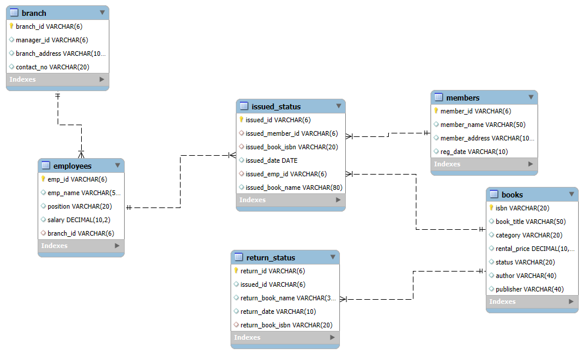

# Library Management System using SQL

## Project Overview

**Project Title**: Library Management System  
**Level**: Intermediate  
**Database**: `library_management`

This project demonstrates the implementation of a Library Management System using SQL. It includes creating and managing tables, performing CRUD operations, and executing advanced SQL queries. The goal is to showcase skills in database design, manipulation, and querying.


## Objectives

1. **Set up the Library Management System Database**: Create and populate the database with tables for branches, employees, members, books, issued status, and return status.
2. **CRUD Operations**: Perform Create, Read, Update, and Delete operations on the data.
3. **CTAS (Create Table As Select)**: Utilize CTAS to create new tables based on query results.
4. **Advanced SQL Queries**: Develop complex queries to analyze and retrieve specific data.

## Project Structure

### 1. Database Setup



- **Database Creation**: Created a database named `library_management`.
- **Table Creation**: Created tables for branches, employees, members, books, issued status, and return status. Each table includes relevant columns and relationships.

```sql
CREATE DATABASE library_management;

USE library_management;

-- CREATE TABLES

-- Create table "books"

CREATE TABLE books (
    isbn VARCHAR(20) PRIMARY KEY,
    book_title VARCHAR(50),
    category VARCHAR(20),
    rental_price DECIMAL(10,2),
    status VARCHAR(20),
    author VARCHAR(40),
    publisher VARCHAR(40)
);
-- Create table "branch"

CREATE TABLE branch (
    branch_id VARCHAR(6) PRIMARY KEY,
    manager_id VARCHAR(6),  
    branch_address VARCHAR(100),
    contact_no VARCHAR(20)
);
-- Create table "employees"

CREATE TABLE employees (
    emp_id VARCHAR(6) PRIMARY KEY,
    emp_name VARCHAR(50),
    position VARCHAR(20),
    salary DECIMAL(10,2),
    branch_id VARCHAR(6),
    CONSTRAINT fk_employees_branch FOREIGN KEY (branch_id) REFERENCES branch(branch_id)
);

-- Create table "members"

CREATE TABLE members (
    member_id VARCHAR(6) PRIMARY KEY,
    member_name VARCHAR(50),
    member_address VARCHAR(100),
    reg_date VARCHAR(10)
);

-- Create table "issued_status"

CREATE TABLE issued_status (
    issued_id VARCHAR(6) PRIMARY KEY,
    issued_member_id VARCHAR(6),
    issued_book_isbn VARCHAR(20),
    issued_date DATE,
    issued_emp_id VARCHAR(6),
    CONSTRAINT fk_issued_status_emp FOREIGN KEY (issued_emp_id) REFERENCES employees(emp_id),
    CONSTRAINT fk_issued_status_book FOREIGN KEY (issued_book_isbn) REFERENCES books(isbn),
    CONSTRAINT fk_issued_status_member FOREIGN KEY (issued_member_id) REFERENCES members(member_id)
);

-- Create table "return_status"

DROP TABLE IF EXISTS return_status;
CREATE TABLE return_status
(
            return_id VARCHAR(6) PRIMARY KEY,
            issued_id VARCHAR(6),
            return_book_name VARCHAR(30),
            return_date VARCHAR(10),
            return_book_isbn VARCHAR(20),
            FOREIGN KEY (return_book_isbn) REFERENCES books(isbn)
);
-- add new column to issued_status
ALTER TABLE issued_status
ADD COLUMN issued_book_name VARCHAR(80)
```


### 2. CRUD Operations

- **Create**: Inserted sample records into the `books` table.
- **Read**: Retrieved and displayed data from various tables.
- **Update**: Updated records in the `employees` table.
- **Delete**: Removed records from the `members` table as needed.

**1. Create a New Book Record**
```sql
INSERT INTO books(isbn, book_title, category, rental_price, status, author, publisher)
VALUES('978-0-45228-849-0', 'Pride and Prejudice', 'Romance', 5.50, 'yes', 'Jane Austen', 'T. Egerton, Whitehall'),
VALUES('978-0-7432-7356-5', 'The Great Gatsby', 'Classic', 5.75, 'yes', 'F. Scott Fitzgerald', 'Charles Scribner\'s Sons');
SELECT * FROM books;
```
**2: Update an Existing Member's Address**

```sql
UPDATE members
SET member_address = '125 Oak St'
WHERE member_id = 'C103';
```

**3: Delete a Record from the Issued Status Table**
-- Objective: Delete the record with issued_id = 'IS121' from the issued_status table.

```sql
DELETE FROM issued_status
WHERE  issued_id =   'IS121';
```

**4: Retrieve All records from Members table**

```sql
SELECT * FROM members;
```

### 3. CTAS (Create Table As Select)

- **Create Summary Tables**: Used CTAS to generate new tables based on query results - each book and total book_issued_cnt

```sql
CREATE TABLE book_issued_count as
SELECT b.isbn,b.book_title,count(*) as TOTAL_BOOK_ISSUED
FROM books b
INNER JOIN issued_status i
ON b.isbn=i.issued_book_isbn
GROUP BY b.isbn,b.book_title
```
### 4.Data Analysis and Finding

**1. Retrieve All Books based on Category**
```sql

SELECT 
    CATEGORY,
    GROUP_CONCAT(book_title SEPARATOR ', ') AS BOOK_LIST
FROM books
GROUP BY category
ORDER BY category;
```
**2.Find Total Rental Income by Category**

```sql
SELECT b.category,count(*) as TOTAL_BOOKS,SUM(b.rental_price) as TOTAL_RENTAL_INCOME
FROM books b
INNER JOIN issued_status i
ON b.isbn=i.issued_book_isbn
GROUP BY b.category
```
**3. List Members Who Registered in the after 2024**

```sql

SELECT member_id,member_name
FROM members
where YEAR(reg_date)>=2024
```
**4.List Employees with Their Branch Manager's Name and their branch details**

```sql
SELECT 
    e1.emp_id,e1.emp_name,e1.position,
    e2.emp_name as manager_name,b1.*
FROM employees e1
INNER JOIN branch b1
ON e1.branch_id=b1.branch_id
INNER JOIN employees e2
ON e2.emp_id=b1.manager_id
```
**5.Create a Table of Books with Rental Price Above a Certain Threshold**
```sql

CREATE TABLE expensive_books AS
SELECT * FROM books
WHERE rental_price>=7
```
**6.Retrieve the List of Books Not Yet Returned**
```sql
SELECT i.issued_book_name as NOT_RETURNED_BOOKS
FROM issued_status i
LEFT JOIN return_status r
ON i.issued_id=r.issued_id
where r.issued_id is null
```
**7.Write a query to identify members who have overdue books (assume a 30-day return period). Display the member's name, book title, issue date, and days overdue.**

```sql
WITH overdue_books AS (
    SELECT 
        i.issued_id,
        i.issued_book_isbn,
        i.issued_date,
        i.issued_member_id,
        b.book_title,
        r.return_date,
        DATEDIFF(COALESCE(r.return_date,CURDATE()), i.issued_date) AS no_of_days
    FROM issued_status i
    JOIN books b 
        ON i.issued_book_isbn = b.isbn
    LEFT JOIN return_status r 
        ON i.issued_id = r.issued_id
)
SELECT 
    ob.issued_member_id,
    m.member_name,
    ob.book_title,
    ob.issued_date,
    ob.no_of_days AS days_overdue,
    CASE 
        WHEN return_date is not null then 'Returned' else 'Not Returned' END AS status_of_book
FROM overdue_books ob
JOIN members m 
    ON ob.issued_member_id = m.member_id
WHERE no_of_days>30
ORDER BY status_of_book,ob.issued_member_id
```
**8. Write a query to update the status of books in the books table to "Yes" when they are returned (based on entries in the return_status table).**

```sql

DELIMITER $$
DROP PROCEDURE IF EXISTS add_return_records $$

CREATE PROCEDURE add_return_records(
    IN new_return_id VARCHAR(6),
    IN o_issued_id VARCHAR(6)
)
BEGIN
    DECLARE v_isbn VARCHAR(50);
    DECLARE v_book_name VARCHAR(80);

    -- Insert into return_status
    INSERT INTO return_status(return_id, issued_id, return_date)
    VALUES(new_return_id, o_issued_id, CURRENT_DATE);

    -- Get book details
    SELECT issued_book_isbn, issued_book_name
    INTO v_isbn, v_book_name
    FROM issued_status
    WHERE issued_id = o_issued_id;

    -- Update book availability
    UPDATE books
    SET status = 'yes'
    WHERE isbn = v_isbn;

    -- Return message
    SELECT CONCAT('Thank you for returning the book: ', v_book_name) AS message;

END $$

DELIMITER ;

--call the procedure
CALL add_return_records('RS139','IS131');
```
**9.Create a query that generates a performance report for each branch, showing the number of books issued, the number of books returned, and the total revenue generated from book rentals.**

```sql

SELECT 
    b.branch_id,
    b.manager_id,
    COUNT(DISTINCT ist.issued_id) as number_book_issued,
    COUNT(DISTINCT rs.return_id) as number_of_book_return,
    SUM(bk.rental_price) as total_revenue
FROM issued_status as ist
JOIN 
employees as e
ON e.emp_id = ist.issued_emp_id
JOIN
branch as b
ON e.branch_id = b.branch_id
LEFT JOIN
return_status as rs
ON rs.issued_id = ist.issued_id
JOIN 
books as bk
ON ist.issued_book_isbn = bk.isbn
GROUP BY 1, 2;
```
**10.Create a Query that  containing members who have issued at least one book in the last 18 months.**
```sql
SELECT * FROM members
WHERE member_id IN (
    select DISTINCT issued_member_id
    from issued_status
    where issued_date>=DATE_SUB(CURRENT_DATE,INTERVAL 18 MONTH)
)
```
**11.Write a query to find the top 3 employees who have processed the most book issues. Display the employee name, number of books processed, and their branch.**
```sql
SELECT issued_emp_id as employee_id,e1.emp_name as name,b1.*,count(*) as book_issued
FROM issued_status i1
INNER JOIN employees e1
ON i1.issued_emp_id=e1.emp_id
INNER JOIN branch b1
USING (branch_id)
GROUP BY i1.issued_emp_id
ORDER BY book_issued desc
LIMIT 3;
```
**12.Create a stored procedure to manage the status of books in a library system. Description: Write a stored procedure that updates the status of a book in the library based on its issuance. The procedure should function as follows: The stored procedure should take the book_id as an input parameter. The procedure should first check if the book is available (status = 'yes'). If the book is available, it should be issued, and the status in the books table should be updated to 'no'. If the book is not available (status = 'no'), the procedure should return an error message indicating that the book is currently not available.**

```sql
DELIMITER $$
CREATE PROCEDURE book_issue(
    IN n_issued_id VARCHAR(6),
    IN n_issued_member_id VARCHAR(6),
    IN n_issued_book_isbn VARCHAR(20),
    IN n_issued_emp_id VARCHAR(6)
)
BEGIN
    DECLARE v_status VARCHAR(20);
    DECLARE v_book_title VARCHAR(80);

    -- Get book status and title
    SELECT status, book_title
    INTO v_status, v_book_title
    FROM books
    WHERE isbn = n_issued_book_isbn
    LIMIT 1;

    -- Check if book is available
    IF v_status = 'yes' THEN
        INSERT INTO issued_status(
            issued_id,
            issued_member_id,
            issued_book_isbn,
            issued_date,
            issued_emp_id,
            issued_book_name
        )
        VALUES(
            n_issued_id,
            n_issued_member_id,
            n_issued_book_isbn,
            CURRENT_DATE,
            n_issued_emp_id,
            v_book_title   
        );

        UPDATE books
        SET status = 'no'
        WHERE isbn = n_issued_book_isbn;

        SELECT CONCAT(v_book_title, ' is successfully issued') AS message;
    ELSE
        SELECT CONCAT(v_book_title, ' is currently unavailable') AS message;
    END IF;
END $$
DELIMITER ;

--Call the procedure

CALL book_issue('IS141','C111','978-0-09-957807-9','E105')
```
**13.Description: Write a CTAS query to create a new table that lists each member and the books they have issued but not returned within 30 days. The table should include: The number of overdue books. The total fines, with each day's fine calculated at $0.50. The number of books issued by each member. The resulting table should show: Member ID Number of overdue books Total fines**
```sql
CREATE TABLE IF NOT EXISTS member_overdue_summary
WITH overdue_books AS (
    SELECT 
        i.issued_member_id,
        DATEDIFF(COALESCE(r.return_date,CURDATE()), i.issued_date) AS no_of_days
    FROM issued_status i
    JOIN books b 
        ON i.issued_book_isbn = b.isbn
    LEFT JOIN return_status r 
        ON i.issued_id = r.issued_id
)
SELECT 
    ob.issued_member_id as member_id,
    m.member_name,
    count(*) as No_of_overdue_books,
    sum(no_of_days) as total_days,
    sum((no_of_days-30)*0.50) as Total_fine
    
FROM overdue_books ob
JOIN members m 
    ON ob.issued_member_id = m.member_id
WHERE no_of_days>30
GROUP BY member_id,m.member_name
ORDER BY member_id;
```

